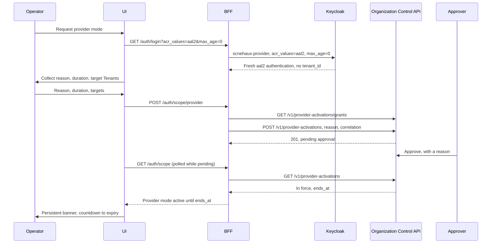

---
doc_meta:
  id: TDD-organization-experience-001
  title: Administrative Scope, Provider Mode, and Safe Bulk Operations
  owner: Core Platform Team
  version: 1.3.0
  status: approved
  classification: restricted
  review_cycle_days: 90
  created_date: 2026-08-11
  last_reviewed: 2026-10-07
  parent_sad: SAD-012
---

# Administrative Scope, Provider Mode, and Safe Bulk Operations

## Purpose

Specify how the Organization administrative experience makes the operator's scope
unmistakable, how provider-scoped cross-tenant work is entered deliberately rather
than drifted into, and how bulk and irreversible operations are presented so that the
outcome is understood before it is committed.

SAD-012 §1 states the requirement plainly: the experience must make administrative
scope explicit and prevent accidental cross-tenant action. That is a user-interface
obligation with a security consequence, which is why it is designed rather than left
to visual convention.

## Scope

**In scope**

- The two administrative scopes and how an operator moves between them.
- Provider mode: entry, assurance, visual state, reason capture, and exit.
- Bulk operations: preview, per-item outcome, and partial-failure presentation.
- Presentation of projection freshness and of revocation that is queued but not yet
  enforced.
- Irreversible operations and their confirmation contract.

**Out of scope**

- The backend-for-frontend session pattern, cookie properties, cross-site request
  forgery defence, refresh, step-up mechanics, and back-channel logout. This
  application conforms to `TDD-identity-experience-001` without variation.
- Membership authority, versions, and revocation mechanics — owned by
  `TDD-organization-control-002`.
- Row-Level Security and the two database runtime roles — owned by
  `TDD-organization-control-001`.
- Visual design language and component composition, owned by the UI Platform once it ships
  its primitives; until then by this repository's own components (SAD-012 1.1.0 §7.3).

## Technical Context

This application conforms in full to the BFF pattern specified in
`TDD-identity-experience-001`: an opaque `__Host-` session cookie, all tokens held
server-side, three independent cross-site request forgery defences, server-side
refresh, and idle plus absolute expiry. Nothing about that pattern is restated or
varied here, and a divergence in this repository is a defect rather than a local
decision.

What differs is the thing this application administers. The Organization control plane
distinguishes two callers at the database level, with two PostgreSQL runtime roles and
two connection pools:

| Scope | Database role | Reaches |
| :-- | :-- | :-- |
| Tenant administration | `organization_rt` | Exactly one Tenant |
| Provider administration | `organization_provider_rt` | Deliberately across Tenants |

That separation is enforced by PostgreSQL and by the API. This design carries it into
the interface, because a boundary the operator cannot see is a boundary the operator
will cross by accident.

## Component Design

| Component | Responsibility |
| :-- | :-- |
| `ScopeContext` | Holds the active scope, exposes it to every view, refuses ambiguous state |
| `ProviderModeGate` | Entry ceremony: step-up, reason, scope selection, expiry |
| `ScopeBanner` | Persistent, non-dismissible indication of the active scope |
| `BulkOperationRunner` | Preview, submit, per-item outcome, resumable reporting |
| `FreshnessIndicator` | Surfaces projection age and stale behavior to the operator |
| `ConfirmationGate` | Confirmation contract for irreversible operations |

### The Two Scopes

```text
Tenant scope                          Provider scope
├── one Tenant, resolved from the     ├── explicitly selected Tenants or all
│   operator's administrative         ├── requires step-up authentication
│   assignment                        ├── requires a reason before entry
├── default on sign-in                ├── time-bounded, expires automatically
└── no reason required                └── every action emits a privileged event
```

An operator never holds both simultaneously. Provider mode is entered, used, and left,
and the session records which scope was active for every action taken.

### The Scopes as Tokens and Records (1.2.0)

The two scopes are two token forms, and the session holds one (`ADR-IAM-008`). This BFF's client
is registered for the `per-sign-in` privileged form, so every sign-in names one:

| Scope    | Sign-in                                                                    | Authority, read by the Organization Control API on every request |
| :------- | :------------------------------------------------------------------------- | :--------------------------------------------------------------- |
| Tenant   | `/auth/login?tenant=<tenant_id>`: `scnehaux-privileged organization:<tenant_id>` | Tenant administration grant, active Membership, active Tenant (`ADR-ORG-003`) |
| Provider | `/auth/login?acr_values=aal2&max_age=0`: `scnehaux-provider`                 | An activation in force, approved by another provider (`ADR-ORG-002 §5.1`) |

- **The scope comes from the session, never from browser input.** The BFF pattern holds the ID
  token's `tenant_id` to the Tenant asked for, and stores the confirmed one
  (`TDD-identity-experience-001` 1.15.0 §Context Switch). A session with a Tenant is in Tenant scope.
  A session without one is in provider scope.
- **Moving between scopes is a sign-in**, which replaces the session. Entering provider scope always
  re-authenticates at `aal2` (`max_age=0`), as Entra PIM can require "reauthentication on every role
  activation" [R1].
- **"Default on sign-in" is the Tenant scope** when the operator names a Tenant. The Tenant is chosen
  on the entry page, or arrives on a deep link, because the kernel's own chooser is not yet asserted
  (`ADR-IAM-008` Alternative D).
- **A provider session is not yet provider mode.** Its holder is eligible: the Organization Control
  API admits it to `/v1/provider-activations` alone. Provider mode is a window: an activation the
  operator requests with a reason and a duration, and another provider approves (§Provider Mode
  Entry).

### Provider Mode Entry

1.2.0 realizes the entry through the provider form's sign-in and an activation, which the
Organization Control API records and enforces (`ADR-ORG-002`, `TDD-organization-control-001`
§Provider Activation).



**The order is the control.**

1. **The step-up comes first.** `POST /auth/scope/provider` refuses a session that is not in the
   provider form, below `aal2`, or whose `auth_time` is older than
   `ORGANIZATION_EXPERIENCE_PROVIDER_STEP_UP_AGE`.
2. **The reason comes before the window opens.** It is the activation's own reason, recorded by the
   Organization Control API at the request, as Entra PIM asks for "a business justification when
   they activate" [R1].
   - A request without one is refused by the BFF, and again by the API.
   - A reason captured after the fact is written by someone who already knows the outcome, which is
     worth less than one written before it.
3. **The duration is bounded twice.** The BFF refuses one above
   `ORGANIZATION_EXPERIENCE_PROVIDER_MAX_DURATION`, and the API refuses one above its own maximum.
4. **Another provider approves**, in production (`ADR-ORG-002 §5.1`). Until then the window is
   pending, and the banner says so.
   - The same application shows a provider the activations awaiting its decision.
   - Approving or denying needs a reason of its own.
   - An operator's own request is never offered to them for approval, and the API refuses it.

**The window ends on its own.** The activation's `ends_at` is the scope's expiry: the duration
counted from the approval. An operator who forgets to leave provider mode leaves it anyway, and the
API stops honouring the activation at that instant whatever the BFF does. Leaving early ends the
activation (`POST /v1/provider-activations/{id}/end`). Signing out ends it too, so authority never
outlives the session that asked for it.

**The targets narrow; they do not grant.** The activation covers the whole provider scope.
- **The window records what the operator named:** explicit Tenants, or all of them. The BFF refuses
  a request naming any other Tenant, in its path or in its body's `tenant_id`.
- **This prevents mistakes, not attacks** (§Security Notes). It is what keeps an operator who meant
  one Tenant from acting on another.

### Scope Visibility

The active scope is shown by a persistent element that cannot be dismissed, collapsed,
or scrolled away, and that names the scope, the target, and the remaining time. Every
destructive control carries the scope in its confirmation text rather than relying on
the operator remembering the banner.

This is deliberate redundancy. The single most likely error in cross-tenant
administration is an operator acting correctly on the wrong Tenant, and that error is
invisible at the moment it is made.

## Data Model

This application holds no domain state. Its client-side model is a read projection of
Control API responses, discarded on sign-out.

The BFF session carries the scope fields on top of the base session defined in
`TDD-identity-experience-001`. 1.2.0 places them:

- **`scope` and the Tenant** are the session's `tenant_id`, confirmed by the ID token.
- **The provider window** is a row of the BFF's own table, `provider_windows`, keyed by the session
  and deleted with it.
  - It holds the activation identifier, the reason, the correlation identifier, the targets, the
    duration, and `ends_at` once approved.
  - `ends_at` is the Organization Control API's. The BFF reads the activation again on each
    `GET /auth/scope`, rather than trusting its copy past the API's answer.

The original field list, as 1.0.0 named it:

```text
scope               tenant | provider
scope_target        tenant identifier, set of identifiers, or all
scope_reason        text, captured before entry
scope_correlation   correlation identifier shared with every emitted event
scope_expiry        absolute, independent of session expiry
```

`scope_expiry` is separate from session expiry so provider mode ends before the
session does. A provider window that outlives the work is an open window.

## API / Interface

All calls proxy through the BFF to the Organization Control API. The application
issues no direct call to any other system, holds no token, and makes no authorization
decision.

```text
GET   /api/v1/organizations
GET   /api/v1/tenants
POST  /api/v1/tenants/{id}:suspend
POST  /api/v1/tenants/{id}:restore
POST  /api/v1/tenants/{id}:begin-offboarding
GET   /api/v1/tenants/{id}/workspaces
GET   /api/v1/tenants/{id}/memberships
POST  /api/v1/memberships
POST  /api/v1/memberships/{id}:suspend
POST  /api/v1/memberships/{id}:revoke
POST  /api/v1/memberships/{id}:restore
GET   /api/v1/projections/organization/consumers/{id}
```

Every mutation carries an idempotency key generated by the BFF, an optimistic version
taken from the record the operator was shown, and the reason and correlation from the
session. A version conflict is surfaced as a conflict rather than retried, because the
operator acted on a view that has since changed.

### The Scope Guard and the BFF's Scope Endpoints (1.2.0)

The routes above are 1.0.0's sketch. The Organization Control API serves its actions as path
segments (`/v1/tenants/{id}/suspend`) and takes the optimistic version as `expected_version` in the
body. Week 3 builds against what it serves.

```text
GET   /auth/scope                  the active scope, and the provider window with its state
POST  /auth/scope/provider         {"reason", "duration_minutes", "tenants": "all" | [tenant_id, ...]}
POST  /auth/scope/provider/end     ends the window and its activation
```

The scope guard runs in the proxy before a request leaves the BFF, and answers `403` with a problem
document naming the scope.

| Active scope              | Reaches                                                                            |
| :------------------------ | :--------------------------------------------------------------------------------- |
| Tenant                    | `/v1/memberships…`, `/v1/workspaces…`, `/v1/invitations…` except the provider-only invitation routes. No path names a Tenant, and the API takes the Tenant from the token |
| Provider, no window       | `/v1/provider-activations…` alone, as the API admits an eligible caller              |
| Provider, window pending  | The same                                                                           |
| Provider, window in force | Every route, except a path or a JSON body naming a Tenant outside the window's targets |

In provider scope the BFF sets two headers on every forwarded request:

- **`X-Administrative-Reason`.** The operator's own reason for the action when the application sends
  one, and otherwise the window's reason. The API requires one on every provider request.
- **`X-Correlation-ID`.** The window's correlation identifier, which the API adopts as the request's
  correlation identifier and records with every privileged access. The scope correlation the data
  model names is therefore on every record the window produced.

A Tenant-scope request carries neither: the API records no privileged access for it.

## Algorithms / Logic

### Bulk Operations

```text
preview:
    submit the selection to the API in preview mode
    render, per item: current state, resulting state, and any refusal with its reason
    render the count of items that would change and the count that would not
    require explicit confirmation naming the count and the scope

execute:
    submit with the idempotency key from the preview
    render per-item outcome as results arrive
    on partial failure: report succeeded, failed, and not-attempted separately
    offer resubmission of the failed subset only, under the same correlation
```

A bulk operation never reports a single aggregate success. SAD-004 §8.3 requires each
item to be validated independently with a per-item outcome, and an interface that
collapses that into one status discards the information the operator needs to recover.

The preview is not advisory. Its idempotency key carries into execution, so the
operator commits the set they were shown rather than the set as it stands at submit
time.

**As served (1.3.0, `ADR-ORG-004` §5.1).** The preview and the execution are a batch
resource of the Organization Control API.
- **The preview.** `POST /v1/membership-batches`, with the action, up to 500 Membership
  identifiers and the reason, returns the server's preview. It runs through the single
  command's own validation.
- **What the batch holds.** Each item's version is pinned when the preview reads it.
  `POST /v1/membership-batches/{id}/execute`, with the `Idempotency-Key` generated for that
  preview, commits it. An item that changed since fails with `409 version-conflict` rather
  than being applied. That is what makes the preview binding.
- **Outcomes.** The interface shows each item's outcome from the batch, under three headings:
  `succeeded`, `failed` (the API's own problem) and `not_attempted`.
- **Resubmitting.** The failed items are previewed again as a new batch that names the one it
  continues, under the same correlation.
- **Larger selections.** A selection larger than the preview limit is several batches,
  previewed and confirmed one at a time and never merged into one count.

### Presenting Revocation Honestly

`TDD-organization-control-002` is explicit that acknowledgement means durable and
queued, not enforced. The interface carries that distinction rather than smoothing it:

| State | Shown as |
| :-- | :-- |
| Accepted | Revocation accepted, with the accepted timestamp |
| Propagating | Enforcing, with the elapsed time against the budget |
| Enforced | Enforced, with the enforced timestamp |
| Over budget | Enforcement delayed, with an escalation path |

**As served (1.3.0, `ADR-ORG-004` §5.2).** The states are derived from recorded evidence.
- **Where they come from.** `GET /v1/memberships/{id}/enforcement` returns:
  - the latest transition's event;
  - per subscribed consumer, whether it recorded `consumer_applied`, `transport_accepted` or
    nothing yet, or was dead-lettered;
  - the propagation budget;
  - the derived state.
- **When it is read.** The interface reads it after a revocation or suspension until the state is
  `enforced` or `over_budget`. It shows the elapsed time against the budget, and names the
  consumers still pending.
- **What `enforced` means.** Every subscribed consumer recorded `consumer_applied`. Delivery
  alone is still propagating.

An interface that reports "revoked" the moment the API returns 202 teaches operators
that revocation is instant. Incident response is then planned around a property the
system does not have, which is the failure the previous implementation produced.

### Presenting Staleness

Where a view is served from a projection whose age exceeds `max_accepted_age` under
`use_with_marker`, the marker is rendered as part of the data rather than as a page-
level notice. An operator reading a Membership list needs to know that list is stale,
at the point of reading it.

Views feeding an irreversible operation never use a marker. They call the
authoritative fresh check, per the staleness policy in
`TDD-organization-control-002`, because a stale read behind an irreversible action is
the case that policy exists to prevent.

**As built, the administrative reads are authoritative (1.3.0).** Every read this
application makes through the Organization Control API is answered from the control
database, not from a projection:
- the Organization, Tenant, Workspace, Membership, invitation and offboarding reads;
- `TDD-organization-control-002`: both Membership reads "run in a read-only transaction on
  the tenant pool".

What 1.2.0 assumed changes in three places:
- **No marker on administrative data.** There is no projection age to mark it with.
  `max_accepted_age` and `use_with_marker` are a projection consumer's declared policy
  (`TDD-organization-control-002` §Staleness Policy). They are shown where consumers are
  shown, on the projection health view (`TDD-organization-experience-002`).
- **The fresh check for an irreversible operation is the authoritative re-read and the
  version it returns.** The operation sends that version as `expected_version`, and a record
  changed in between answers `409 version-conflict`. `POST /v1/context/verify` is a
  projection consumer's call, metered per consumer, and refused to an administrator. It is
  not used here.
- **Counts come from the API.** An irreversible operation's affected count is read from the
  API immediately before the confirmation (§Irreversible Operations).

### Irreversible Operations

Tenant offboarding, Tenant retirement, and bulk revocation require:

1. The scope named in the confirmation text, not only in the banner.
2. The count of affected subjects, computed by the API rather than by the client.
3. Typed confirmation of the target name for Tenant retirement.
4. A reason, which is already present in provider mode and is required in tenant mode.

Offboarding is presented as resumable and staged, matching SAD-004 §5.6. It is never
presented as a single irreversible button, because it is neither single nor immediate.

## Configuration

| Variable | Default | Purpose |
| :-- | :-- | :-- |
| `ORGANIZATION_EXPERIENCE_PROVIDER_MAX_DURATION` | `60m` | Ceiling on one provider-mode window |
| `ORGANIZATION_EXPERIENCE_PROVIDER_DEFAULT_DURATION` | `15m` | Default offered at entry |
| `ORGANIZATION_EXPERIENCE_BULK_PREVIEW_LIMIT` | `500` | Items per preview page |
| `ORGANIZATION_EXPERIENCE_PROVIDER_STEP_UP_AGE` | `5m` | How recent the provider sign-in's `auth_time` must be to request a window (1.2.0) |
| `ORGANIZATION_EXPERIENCE_ORGANIZATION_CONTROL_URL` | none, required | Organization Control API, under this application's prefix like every other setting (1.1.0) |

Session, cookie, refresh, and client credential settings are inherited unchanged from
`TDD-identity-experience-001`.

## Testing Strategy

### Scope

- An operator in tenant scope cannot issue a request naming another Tenant, and the
  attempt is refused before it leaves the BFF.
- Provider mode requires step-up; a session without elevated assurance cannot enter it.
- Provider mode without a reason cannot be entered.
- The scope banner is present on every view and cannot be dismissed.
- Provider mode expires at `scope_expiry` and the operator returns to tenant scope.
- Every action taken in provider mode carries the scope correlation identifier.
- 1.2.0:
  - a Tenant-scope request for a provider route, or naming another Tenant, is refused by the BFF and
    never reaches the API;
  - a provider session reaches only the activation routes until its window is in force;
  - a window request without a reason, above the maximum duration, from a session that is not a
    fresh `aal2` provider sign-in, or naming no target is refused;
  - an in-force window refuses a Tenant outside its targets, in the path or the body;
  - a request in provider mode carries the window's reason and correlation identifier;
  - a window past `ends_at` reaches nothing but the activation routes;
  - leaving provider mode and signing out each end the activation.

### Bulk Operations

- A preview reports per-item resulting state and per-item refusal reasons.
- Execution uses the idempotency key issued with the preview.
- Partial failure reports succeeded, failed, and not-attempted separately.
- Resubmitting the failed subset does not repeat succeeded items.
- A selection exceeding the preview limit is paged rather than truncated silently.

### Honest Presentation

- A revocation is shown as accepted and not as enforced until the enforced timestamp
  arrives. As served, it shows as `enforced` only when every subscribed consumer has recorded
  `consumer_applied` (1.3.0).
- Enforcement exceeding budget is surfaced with an escalation path.
- A stale projection renders its marker inline with the data. As built, this applies only to
  the consumers on the projection health view (1.3.0).
- A view feeding an irreversible operation reads the record again and sends the version
  it read; a change in between is shown as a conflict (1.3.0).

### Conformance

- Session cookie properties match `TDD-identity-experience-001` exactly.
- No token, credential, or client secret appears in any response or built artifact.
- Every mutation carries an idempotency key, an optimistic version, a reason, and a
  correlation identifier.
- A version conflict is surfaced rather than retried.

## Security Notes

The interface is defence in depth. STD-IAM-001 §3.9 is explicit that user-interface
authorization is a user-experience control and that backend authorization remains
authoritative. Every control this design hides is also refused by the Organization
Control API, and the hiding exists to prevent mistakes rather than to prevent attacks.

Provider mode is the highest-risk surface in this application, and its controls are
chosen accordingly: elevated assurance, a reason recorded before the fact, automatic
expiry, persistent visibility, and a privileged-administration event for every action.
Those five together mean a cross-tenant action cannot be taken silently, cannot be
taken indefinitely, and cannot be taken without an attributable reason.

Presenting a queued revocation as enforced would be a security defect expressed in the
interface layer. It is treated as one here.

## Performance Notes

Bulk preview is bounded by page size and computed server-side, so a large selection
costs the operator a paged review rather than costing the control plane an unbounded
query.

1.2.0 said views render from projections. As built they are authoritative reads, paged
by keyset (STD-GLB-001 1.3.0), so ordinary browsing costs one indexed page per request. An
irreversible operation adds one re-read before it is confirmed (§Presenting Staleness).

## Operational Notes

| Signal | Warning | Critical |
| :-- | :-- | :-- |
| Provider-mode sessions per operator per day | above baseline | — |
| Provider mode entered without a subsequent action | any occurrence | — |
| Bulk operation partial-failure rate | above baseline | — |
| Version conflicts on mutation | above baseline | — |
| Revocation shown over budget | any occurrence | sustained |

Provider mode entered and unused is worth reviewing. It usually means an operator
elevated to read something they could have read without elevating, which indicates the
tenant-scope views are missing information rather than that the operator did wrong.

Runbooks required before production: provider-access review, bulk operation partial
failure recovery, and stuck offboarding.

## Traceability

| Relationship | Target |
| :-- | :-- |
| Parent system | SAD-012 — Scnehaux Organization Experience |
| Realizes capability | PAD-PLT-002 — Organization & Tenancy Platform |
| Governed by | ADR-ORG-001 — Separate Organization Authority and Keycloak Projection |
| Conforms to | `TDD-identity-experience-001` — BFF session and browser security, without variation |
| Conforms to | STD-IAM-001 §3.9 — UI authorization is defence in depth; backend authorization is authoritative |
| Conforms to | STD-IAM-002 §3.1 — `privileged` audience class |
| Enterprise constraint | EAD-006 — privileged access is scoped, time-bounded, attributable, and evidenced |
| Depends on | `organization-control` — the Organization Control API, which reauthorizes every command |
| Depends on | `identity-kernel` — hosted login and step-up |
| Build-time dependency | `scnehaux-ui-platform` — design system packages, once shipped (SAD-012 1.1.0 §1, §7.3) |
| Conforms to | SAD-012 1.1.0 — a React SPA built with Vite behind the identity Fastify BFF, as ADR-GLB-FE-003 §5 and ADR-GLB-FE-011 §5.2 place an internal tool |
| Governed by | ADR-IAM-008 — one client, the privileged form chosen per sign-in (1.2.0) |
| Governed by | ADR-ORG-004 — bulk actions previewed by the server, revocation shown by its evidence (1.3.0) |
| Governed by | ADR-ORG-002 — provider authority is an approved, time-bounded activation (1.2.0) |
| Governed by | ADR-ORG-003 — Tenant administration grant (1.2.0) |

### Standalone Operation

This repository requires no Scnehaux platform other than the five it shares this
foundation with. It has no dependency on Notification, Audit, Software Catalog, or
Subscription & Entitlement. `scnehaux-ui-platform` becomes its build-time dependency once
UI Platform ships its primitives (SAD-012 1.1.0 §7.3).

## References

| Ref | Source |
| :-- | :-- |
| R1 | Microsoft, *Configure Microsoft Entra role settings in Privileged Identity Management*, <https://learn.microsoft.com/en-us/entra/id-governance/privileged-identity-management/pim-how-to-change-default-settings>, accessed 2026-10-07: "You can require users to enter a business justification when they activate the eligible assignment"; "To enforce reauthentication on every role activation, configure the Conditional Access policy targeting your authentication context with sign-in frequency set to Every time under Session controls"; activation maximum duration "can be from one to 24 hours". |
| R2 | OWASP, *Multi-Tenant Application Security Cheat Sheet*, §1, <https://cheatsheetseries.owasp.org/cheatsheets/Multi_Tenant_Security_Cheat_Sheet.html>, accessed 2026-10-04 (as quoted by ADR-IAM-006): "Treat client-supplied tenant identifiers as selectors only. Verify that the authenticated principal is authorized to act in the selected tenant." The window's targets and the entry page's Tenant are selectors; the API decides. |
