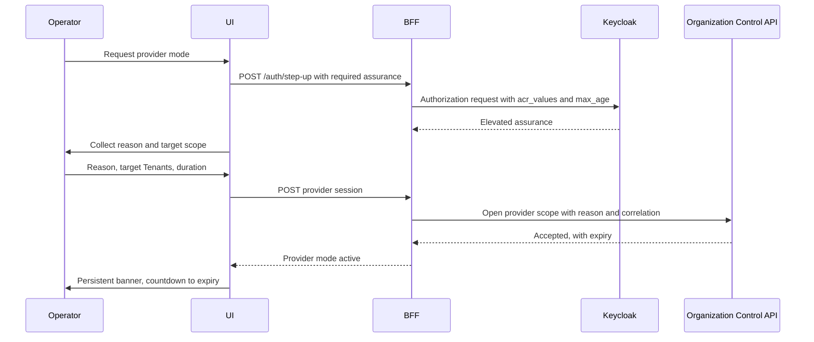

---
doc_meta:
  id: TDD-organization-experience-001
  title: Administrative Scope, Provider Mode, and Safe Bulk Operations
  owner: Core Platform Team
  version: 1.0.0
  status: approved
  classification: restricted
  review_cycle_days: 90
  created_date: 2026-08-11
  last_reviewed: 2026-08-11
  parent_sad: SAD-012
---

# Administrative Scope, Provider Mode, and Safe Bulk Operations

## Purpose

Specify how the Organization administrative experience makes the operator's scope
unmistakable, how provider-scoped cross-tenant work is entered deliberately rather
than drifted into, and how bulk and irreversible operations are presented so that the
outcome is understood before it is committed.

SAD-012 §1 states the requirement plainly: the experience must make administrative
scope explicit and prevent accidental cross-tenant action. That is a user-interface
obligation with a security consequence, which is why it is designed rather than left
to visual convention.

## Scope

**In scope**

- The two administrative scopes and how an operator moves between them.
- Provider mode: entry, assurance, visual state, reason capture, and exit.
- Bulk operations: preview, per-item outcome, and partial-failure presentation.
- Presentation of projection freshness and of revocation that is queued but not yet
  enforced.
- Irreversible operations and their confirmation contract.

**Out of scope**

- The backend-for-frontend session pattern, cookie properties, cross-site request
  forgery defence, refresh, step-up mechanics, and back-channel logout. This
  application conforms to `TDD-identity-experience-001` without variation.
- Membership authority, versions, and revocation mechanics — owned by
  `TDD-organization-control-002`.
- Row-Level Security and the two database runtime roles — owned by
  `TDD-organization-control-001`.
- Visual design language and component composition, owned by the UI Platform.

## Technical Context

This application conforms in full to the BFF pattern specified in
`TDD-identity-experience-001`: an opaque `__Host-` session cookie, all tokens held
server-side, three independent cross-site request forgery defences, server-side
refresh, and idle plus absolute expiry. Nothing about that pattern is restated or
varied here, and a divergence in this repository is a defect rather than a local
decision.

What differs is the thing this application administers. The Organization control plane
distinguishes two callers at the database level, with two PostgreSQL runtime roles and
two connection pools:

| Scope | Database role | Reaches |
| :-- | :-- | :-- |
| Tenant administration | `organization_rt` | Exactly one Tenant |
| Provider administration | `organization_provider_rt` | Deliberately across Tenants |

That separation is enforced by PostgreSQL and by the API. This design carries it into
the interface, because a boundary the operator cannot see is a boundary the operator
will cross by accident.

## Component Design

| Component | Responsibility |
| :-- | :-- |
| `ScopeContext` | Holds the active scope, exposes it to every view, refuses ambiguous state |
| `ProviderModeGate` | Entry ceremony: step-up, reason, scope selection, expiry |
| `ScopeBanner` | Persistent, non-dismissible indication of the active scope |
| `BulkOperationRunner` | Preview, submit, per-item outcome, resumable reporting |
| `FreshnessIndicator` | Surfaces projection age and stale behavior to the operator |
| `ConfirmationGate` | Confirmation contract for irreversible operations |

### The Two Scopes

```text
Tenant scope                          Provider scope
├── one Tenant, resolved from the     ├── explicitly selected Tenants or all
│   operator's administrative         ├── requires step-up authentication
│   assignment                        ├── requires a reason before entry
├── default on sign-in                ├── time-bounded, expires automatically
└── no reason required                └── every action emits a privileged event
```

An operator never holds both simultaneously. Provider mode is entered, used, and left,
and the session records which scope was active for every action taken.

### Provider Mode Entry



Reason is collected **before** the scope opens, not attached afterwards. A reason
captured after the fact is written by someone who already knows the outcome, which is
worth less than one written before it.

The mode expires on its own. An operator who forgets to leave provider mode leaves it
anyway.

### Scope Visibility

The active scope is shown by a persistent element that cannot be dismissed, collapsed,
or scrolled away, and that names the scope, the target, and the remaining time. Every
destructive control carries the scope in its confirmation text rather than relying on
the operator remembering the banner.

This is deliberate redundancy. The single most likely error in cross-tenant
administration is an operator acting correctly on the wrong Tenant, and that error is
invisible at the moment it is made.

## Data Model

This application holds no domain state. Its client-side model is a read projection of
Control API responses, discarded on sign-out.

The BFF session carries the scope fields on top of the base session defined in
`TDD-identity-experience-001`:

```text
scope               tenant | provider
scope_target        tenant identifier, set of identifiers, or all
scope_reason        text, captured before entry
scope_correlation   correlation identifier shared with every emitted event
scope_expiry        absolute, independent of session expiry
```

`scope_expiry` is separate from session expiry so provider mode ends before the
session does. A provider window that outlives the work is an open window.

## API / Interface

All calls proxy through the BFF to the Organization Control API. The application
issues no direct call to any other system, holds no token, and makes no authorization
decision.

```text
GET   /api/v1/organizations
GET   /api/v1/tenants
POST  /api/v1/tenants/{id}:suspend
POST  /api/v1/tenants/{id}:restore
POST  /api/v1/tenants/{id}:begin-offboarding
GET   /api/v1/tenants/{id}/workspaces
GET   /api/v1/tenants/{id}/memberships
POST  /api/v1/memberships
POST  /api/v1/memberships/{id}:suspend
POST  /api/v1/memberships/{id}:revoke
POST  /api/v1/memberships/{id}:restore
GET   /api/v1/projections/organization/consumers/{id}
```

Every mutation carries an idempotency key generated by the BFF, an optimistic version
taken from the record the operator was shown, and the reason and correlation from the
session. A version conflict is surfaced as a conflict rather than retried, because the
operator acted on a view that has since changed.

## Algorithms / Logic

### Bulk Operations

```text
preview:
    submit the selection to the API in preview mode
    render, per item: current state, resulting state, and any refusal with its reason
    render the count of items that would change and the count that would not
    require explicit confirmation naming the count and the scope

execute:
    submit with the idempotency key from the preview
    render per-item outcome as results arrive
    on partial failure: report succeeded, failed, and not-attempted separately
    offer resubmission of the failed subset only, under the same correlation
```

A bulk operation never reports a single aggregate success. SAD-004 §8.3 requires each
item to be validated independently with a per-item outcome, and an interface that
collapses that into one status discards the information the operator needs to recover.

The preview is not advisory. Its idempotency key carries into execution, so the
operator commits the set they were shown rather than the set as it stands at submit
time.

### Presenting Revocation Honestly

`TDD-organization-control-002` is explicit that acknowledgement means durable and
queued, not enforced. The interface carries that distinction rather than smoothing it:

| State | Shown as |
| :-- | :-- |
| Accepted | Revocation accepted, with the accepted timestamp |
| Propagating | Enforcing, with the elapsed time against the budget |
| Enforced | Enforced, with the enforced timestamp |
| Over budget | Enforcement delayed, with an escalation path |

An interface that reports "revoked" the moment the API returns 202 teaches operators
that revocation is instant. Incident response is then planned around a property the
system does not have, which is the failure the previous implementation produced.

### Presenting Staleness

Where a view is served from a projection whose age exceeds `max_accepted_age` under
`use_with_marker`, the marker is rendered as part of the data rather than as a page-
level notice. An operator reading a Membership list needs to know that list is stale,
at the point of reading it.

Views feeding an irreversible operation never use a marker. They call the
authoritative fresh check, per the staleness policy in
`TDD-organization-control-002`, because a stale read behind an irreversible action is
the case that policy exists to prevent.

### Irreversible Operations

Tenant offboarding, Tenant retirement, and bulk revocation require:

1. The scope named in the confirmation text, not only in the banner.
2. The count of affected subjects, computed by the API rather than by the client.
3. Typed confirmation of the target name for Tenant retirement.
4. A reason, which is already present in provider mode and is required in tenant mode.

Offboarding is presented as resumable and staged, matching SAD-004 §5.6. It is never
presented as a single irreversible button, because it is neither single nor immediate.

## Configuration

| Variable | Default | Purpose |
| :-- | :-- | :-- |
| `ORGANIZATION_EXPERIENCE_PROVIDER_MAX_DURATION` | `60m` | Ceiling on one provider-mode window |
| `ORGANIZATION_EXPERIENCE_PROVIDER_DEFAULT_DURATION` | `15m` | Default offered at entry |
| `ORGANIZATION_EXPERIENCE_BULK_PREVIEW_LIMIT` | `500` | Items per preview page |
| `ORGANIZATION_CONTROL_BASE_URL` | none, required | Organization Control API |

Session, cookie, refresh, and client credential settings are inherited unchanged from
`TDD-identity-experience-001`.

## Testing Strategy

### Scope

- An operator in tenant scope cannot issue a request naming another Tenant, and the
  attempt is refused before it leaves the BFF.
- Provider mode requires step-up; a session without elevated assurance cannot enter it.
- Provider mode without a reason cannot be entered.
- The scope banner is present on every view and cannot be dismissed.
- Provider mode expires at `scope_expiry` and the operator returns to tenant scope.
- Every action taken in provider mode carries the scope correlation identifier.

### Bulk Operations

- A preview reports per-item resulting state and per-item refusal reasons.
- Execution uses the idempotency key issued with the preview.
- Partial failure reports succeeded, failed, and not-attempted separately.
- Resubmitting the failed subset does not repeat succeeded items.
- A selection exceeding the preview limit is paged rather than truncated silently.

### Honest Presentation

- A revocation is shown as accepted and not as enforced until the enforced timestamp
  arrives.
- Enforcement exceeding budget is surfaced with an escalation path.
- A stale projection renders its marker inline with the data.
- A view feeding an irreversible operation performs the authoritative fresh check.

### Conformance

- Session cookie properties match `TDD-identity-experience-001` exactly.
- No token, credential, or client secret appears in any response or built artifact.
- Every mutation carries an idempotency key, an optimistic version, a reason, and a
  correlation identifier.
- A version conflict is surfaced rather than retried.

## Security Notes

The interface is defence in depth. STD-IAM-001 §3.9 is explicit that user-interface
authorization is a user-experience control and that backend authorization remains
authoritative. Every control this design hides is also refused by the Organization
Control API, and the hiding exists to prevent mistakes rather than to prevent attacks.

Provider mode is the highest-risk surface in this application, and its controls are
chosen accordingly: elevated assurance, a reason recorded before the fact, automatic
expiry, persistent visibility, and a privileged-administration event for every action.
Those five together mean a cross-tenant action cannot be taken silently, cannot be
taken indefinitely, and cannot be taken without an attributable reason.

Presenting a queued revocation as enforced would be a security defect expressed in the
interface layer. It is treated as one here.

## Performance Notes

Bulk preview is bounded by page size and computed server-side, so a large selection
costs the operator a paged review rather than costing the control plane an unbounded
query.

Views render from projections, so ordinary browsing performs no authoritative read.
The authoritative fresh check appears only ahead of irreversible operations, which is
where its 200 ms budget is spent.

## Operational Notes

| Signal | Warning | Critical |
| :-- | :-- | :-- |
| Provider-mode sessions per operator per day | above baseline | — |
| Provider mode entered without a subsequent action | any occurrence | — |
| Bulk operation partial-failure rate | above baseline | — |
| Version conflicts on mutation | above baseline | — |
| Revocation shown over budget | any occurrence | sustained |

Provider mode entered and unused is worth reviewing. It usually means an operator
elevated to read something they could have read without elevating, which indicates the
tenant-scope views are missing information rather than that the operator did wrong.

Runbooks required before production: provider-access review, bulk operation partial
failure recovery, and stuck offboarding.

## Traceability

| Relationship | Target |
| :-- | :-- |
| Parent system | SAD-012 — Scnehaux Organization Experience |
| Realizes capability | PAD-PLT-002 — Organization & Tenancy Platform |
| Governed by | ADR-ORG-001 — Separate Organization Authority and Keycloak Projection |
| Conforms to | `TDD-identity-experience-001` — BFF session and browser security, without variation |
| Conforms to | STD-IAM-001 §3.9 — UI authorization is defence in depth; backend authorization is authoritative |
| Conforms to | STD-IAM-002 §3.1 — `privileged` audience class |
| Enterprise constraint | EAD-006 — privileged access is scoped, time-bounded, attributable, and evidenced |
| Depends on | `organization-control` — the Organization Control API, which reauthorizes every command |
| Depends on | `identity-kernel` — hosted login and step-up |
| Build-time dependency | `scnehaux-ui-platform` — design system packages, per SAD-012 §1 |

### Standalone Operation

This repository requires no Scnehaux platform other than the five it shares this
foundation with. Its one build-time dependency is `scnehaux-ui-platform`, which
produces no runtime edge. It has no dependency on Notification, Audit, Software
Catalog, or Subscription & Entitlement.
